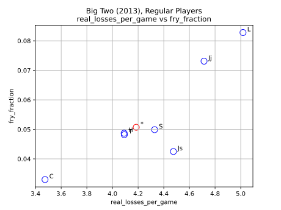
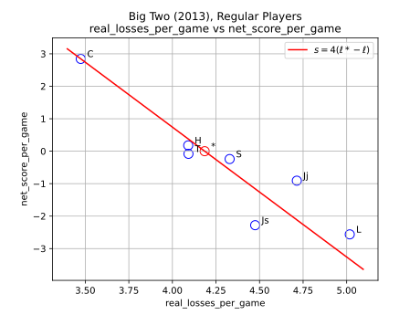
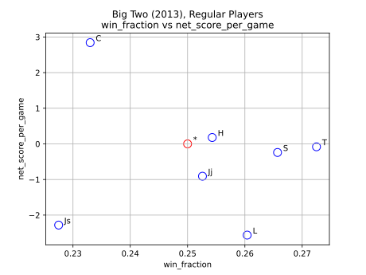

# big-two-scorer

A Python scorer for Big Two (鋤大弟).

Licensed under MIT No Attribution (MIT-0), see [LICENSE].


## Usage

```bash
$ path/to/big2.py [-h] [-v] scores.txt

Score some games of Big Two (鋤大弟).

positional arguments:
  scores.txt     name of scores file; output written to `{scores.txt}.tsv`

optional arguments:
  -h, --help     show this help message and exit
  -v, --version  show program's version number and exit
```


## Scores file syntax

The scorer reads a plain-text file of Big Two scores.
Each line must have one of the following forms:

| Form | Meaning |
| - | - |
| `<yyyy>-<mm>-<dd>` | a date |
| `F=<threshold>` | a declaration of fry threshold (default 10) |
| `<P1> <P2> <P3> <P4>` | a list of player names (no hashes, asterisks, or leading digits) |
| `<L1> <L2> <L3> <L4>` | a list of losses (number of cards with optional suffix `t` for a player taking on all losses) |
| `# <comment>` | a comment, also allowed at the end of the forms above |


## Output data

| Column | Explanation |
| - | - |
| `name` | player name; bottom row `*` is the aggregate of all players |
| `is_regular` | whether player has played at least a quarter of all games |
| `game_count` | total number of games played |
| `win_count` | total number of games won |
| `fry_count` | total number of games where player has been fried |
| `real_losses` | total number of cards lost, accounting for fry multipliers |
| `net_score` | total zero-sum score based on paying out `real_losses` to each other player |
| `win_fraction` | `win_count` divided by `game_count` |
| `fry_fraction` | `fry_count` divided by `game_count` |
| `real_losses_per_game` | `real_losses` divided by `game_count` |
| `net_score_per_game` | `net_score` divided by `game_count` |


## Simple example

For the input scores file [`examples/simple.txt`]:

```
a b c d
0 11 12 13
1 1 1 0

x b c d
3t 0 1 2  # x takes on all losses for not playing high enough
0t 1 1 1  # x takes on all losses for failing to announce 'last card'
```

the output is the TSV file [`examples/simple.txt.tsv`]:

| name | is_regular | game_count | win_count | fry_count | real_losses | net_score | win_fraction | fry_fraction | real_losses_per_game | net_score_per_game |
| - | - | - | - | - | - | - | - | - | - | - |
| a | True | 2 | 1 | 0 | 1 | 84 | 0.5 | 0 | 0.5 | 42 |
| x | True | 2 | 1 | 0 | 9 | -27 | 0.5 | 0 | 4.5 | -13.5 |
| b | True | 4 | 1 | 1 | 23 | 5 | 0.25 | 0.25 | 5.75 | 1.25 |
| c | True | 4 | 0 | 1 | 25 | -3 | 0 | 0.25 | 6.25 | -0.75 |
| d | True | 4 | 1 | 1 | 39 | -59 | 0.25 | 0.25 | 9.75 | -14.75 |
| * | True | 16 | 4 | 3 | 97 | 0 | 0.25 | 0.1875 | 6.0625 | 0 |


## Technical details

### Frying and 'real loss'

Frying (炒) is the practice of applying a multiplier when the raw loss (number of cards) is high.
By 'real loss' of each game we refer to the loss after accounting for the multiplier, implemented as

$$
  \text{real loss} =
  \begin{cases}
    \text{loss}, & \text{loss} < \text{fry threshold} \\
    2 \cdot \text{loss}, & \text{loss} < \text{triple-fry threshold} \\
    3 \cdot \text{loss}, & \text{otherwise}.
  \end{cases}
$$

Here, 'fry threshold' is configurable (with a default value of 10),
and 'triple-fry threshold' is always 13.

To switch off frying altogether, set 'fry threshold' to a sufficiently large integer
(for example, `F=1000`).

### 'Net score' (or 'zero-sum score')

Having computed the 'real losses', the 'net scores' of each game are calculated based on
each player paying out their 'real loss' to each other player.

For example, if the 'real losses' are $\ell_a$, $\ell_b$, $\ell_c$, $\ell_d$,
then the four 'net scores' are

$$
  \begin{align}
    s_a &= (\ell_b + \ell_c + \ell_d) - 3 \ell_a = T - 4 \ell_a \\
    s_b &= (\ell_a + \ell_c + \ell_d) - 3 \ell_b = T - 4 \ell_b \\
    s_c &= (\ell_a + \ell_b + \ell_d) - 3 \ell_c = T - 4 \ell_c \\
    s_d &= (\ell_a + \ell_b + \ell_c) - 3 \ell_d = T - 4 \ell_d, \\
  \end{align}
$$

where $T = \ell_a + \ell_b + \ell_c + \ell_d$ is the total 'real loss'.

### Taking on all losses

There are two scenarios where a player takes on all losses
(denoted by the suffix `t` after the numerical loss score):

1. Failing to prevent the next player winning on last card,
   either by not playing a high-enough single, or not playing a pair, triple, etc.,
   though possible
2. Failing to announce last card and subsequently winning.

In such cases, the total 'real losses' are accrued to the offending player,
and the other players accrue no 'real loss'.
The 'net scores' are calculated accordingly.

Note that, in the implementation, wins and fries are still attributed
to the original winner and fryees (for the purpose of `win_count` and `fry_count`),
even when 'real losses' are accrued to different players
as a result of someone taking on all losses.


## Scores from 2013

I have transcribed the handwritten scores from 2013 into text format for the scorer.
By running the scorer for each new day's worth of scores transcribed,
I discovered several mistakes in the calculations at the time (apologies).

See [`2013/big-two-2013.txt`] for details.

Back then I didn't do zero-sum scoring. Using the scorer, I can now report that

- C averaged +2.84 per game
- H averaged +0.18 per game
- All other regular players averaged a negative net score per game
  (see [Plot&nbsp;3](#3-real_losses_per_game-vs-net_score_per_game)).

See [`2013/big-two-2013.txt.tsv`] for details.

Finally, I have generated some interesting plots with [`2013/plot.py`]:

### 1. `real_losses_per_game` vs `win_fraction`


- C's strategy is to reduce the number of cards lost in every game,
  at the expense of winning games.

### 2. `real_losses_per_game` vs `fry_fraction`



- There looks to be a straight-line relationship here,
  except for Js who is appears to be a lightning rod for fries.

### 3. `real_losses_per_game` vs `net_score_per_game`



### 4. `win_fraction` vs `net_score_per_game`

The red line is the theoretical relationship
between 'net score' $s$ and 'real losses' $\ell$.
With $T$ denoting the total 'real losses'
and $\ell^*$ denoting the 'real losses' for the average player, we have

$$
  s = T - 4 \ell = 4 (\ell^* - \ell).
$$



- Again, C's strategy is to reduce the number of cards lost in every game,
  at the expense of winning games. This is a good strategy for performing
  better than the average player (`*`), and hence doing well in 'net score'
  or 'zero-sum' terms.


[LICENSE]: LICENSE
[`examples/simple.txt`]: examples/simple.txt
[`examples/simple.txt.tsv`]: examples/simple.txt.tsv
[`2013/big-two-2013.txt`]: 2013/big-two-2013.txt
[`2013/big-two-2013.txt.tsv`]: 2013/big-two-2013.txt.tsv
[`2013/plot.py`]: 2013/plot.py
